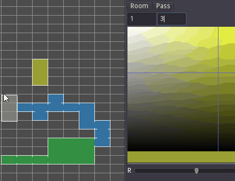

# Schematic Map Editor

Simple tool to work with metroidvania-esques maps.

# Architecture

There is 2 layers: data and visual.

Data layer contains all objects meta, placements, sizes, comments. Also, data works with export and save-load features.

Visual layer work with display; animation, scale, etc.

Presenter glues this layers together.

## Data

Main item is grid. Every cell is a dict with `objects` and `meta` keys.

Available objects:

* Room. Can be different size and color
* Pass. Just vector2 with local room coordinates. `[0, 0.5]` coordinate - pass to the left in top-left corner. `[size.x, size.y - 0.5]` - pass to the right in bottom right corner

# TODOs?

* Items
* Comments
* Export to png
* Save and load
* Pathfinding?
